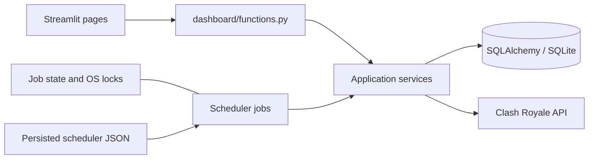

# Clash Royale Clan Manager

A local dashboard for clan members, activity, war participation, contribution
scores, and leadership recommendations. It collects Clash Royale data and keeps
your clan's history on your computer. Recommendations do not change anyone's
role or remove anyone from the clan.

**Just want to use it? [English user guide](docs/user-guide.md#english) ·
[Guide utilisateur en français](docs/user-guide.md#francais).**

This README is the technical reference for developers, administrators, and curious
users. Updated: **2026-10-07** · Document version: **1.0.0** (documentation only).

Current application version: **1.0.0** (tag **v1.0.0**). On October 7 the operator
reported successful launcher builds, installed update/synchronization, and
completed-history confirmation of race 137/0. These are operator-reported
acceptance results; the retained October 6 JSON samples still say pending.
[Release downloads](https://github.com/RaphaelDP/clash-royale-manager/releases/tag/v1.0.0)
are published after this tag’s checks and all four launcher builds pass.
See the [roadmap and release record](docs/roadmap.md#operator-acceptance--2026-10-07).
Forecasting and dedicated player comparison are optional later improvements.

## Contents

- [Features and pages](#features-and-pages)
- [Desktop installation](#desktop-installation-no-coding)
- [Python installation](#python-installation)
- [Command reference](#command-reference)
- [Makefile reference](#makefile-reference)
- [Configuration](#configuration)
- [Scheduler and manual execution](#scheduler-and-manual-execution)
- [Docker deployment](#docker-deployment)
- [Backup and restore](#backup-and-restore)
- [Troubleshooting](#troubleshooting)
- [Closing the application](#closing-the-application)
- [Build on GitHub](#build-on-github-maintainers)
- [Architecture and data semantics](#architecture-and-data-semantics)
- [Release procedure](#release-procedure)

## Features and pages

| Page | What it provides |
| --- | --- |
| Home | Welcome and navigation. |
| Overview | Clan health, rankings, trends, freshness, member/war refresh and score recalculation. |
| Members | Member list, role filters, activity and rankings. |
| Player | API profile, current deck, war statistics, contribution and snapshot history; cached fallback. |
| Promotions | Contribution components, promotion/demotion and kick recommendations, inactivity, CSV export. |
| Wars | Current training/battle phase, season statistics, weekly comparisons and player details. |
| Settings | Configuration summary, logs/downloads, job health, editable scheduler settings. |

The application manages one configured clan. History grows as collection runs;
it cannot reconstruct daily snapshots from before installation or while the
computer was off. Training days are not missed war participation. A season has
four or five weekly races, each comprising three training and four battle days.

## Desktop installation (no coding)

Use the [bilingual user guide](docs/user-guide.md) for step-by-step instructions using the actual button labels without terminal commands. A compiled launcher needs
Docker, the matching extracted application source folder, and a configured API
key; it does not need a local Python installation.

The launcher is a Docker controller, not a self-contained copy of the dashboard.
It finds the project from its location under `launch/`, creates a missing
`.env` from `.env.example`, and prompts for missing settings.
Normal startup reuses the image. **Update application** rebuilds from the source
files already on disk; it does **not** download a new release or pull Git changes.

## Python installation

Use Python **3.12 or newer**; the workflow currently tests 3.12. Work from the
repository root. Do not run a native Python instance and Docker against the same
database at the same time.

Linux/macOS (Bash):

```bash
git clone https://github.com/RaphaelDP/clash-royale-manager.git
cd clash-royale-manager
python3 -m venv .venv
source .venv/bin/activate
python -m pip install -r requirements-dev.txt
cp .env.example .env
```

Windows (PowerShell):

```powershell
git clone https://github.com/RaphaelDP/clash-royale-manager.git
cd clash-royale-manager
py -3.12 -m venv .venv
.\.venv\Scripts\python.exe -m pip install -r requirements-dev.txt
Copy-Item .env.example .env
```

Fill in `CR_API_TOKEN` and `CLAN_TAG` in your private `.env`; keep the default
SQLite paths. Leave `DISCORD_WEBHOOK_URL` blank unless reports are wanted.
Authorize the machine's public IP for the API key in the
[Clash Royale developer portal](https://developer.clashroyale.com/).
Copy the template only on first installation: do not overwrite an existing
configuration. `requirements.txt` installs runtime dependencies only;
`requirements-dev.txt` also installs development tools.

Start with:

```bash
python -m scripts.run_app
```

On Windows without an activated environment, substitute
`.\.venv\Scripts\python.exe` for `python`.
Open [the dashboard](http://localhost:8501). Startup upgrades the schema, attempts
collection, and starts the scheduler and dashboard. Back up existing data before
an upgrade. A collection failure leaves existing data available; an incompatible
schema prevents startup.

## Command reference

These commands run from the project root in its Python environment. Unless
explicitly isolated below, operational commands use the configured database and
may write runtime data. None of the scripts requires a shell alias.

| Command | Options and effect |
| --- | --- |
| `python -m scripts.run_app` | Full supervised application; no custom flags. Preferred entry point. |
| `python -m scripts.init_db` | Upgrade/create database through Alembic; no custom flags. Also installed as `init_db`. |
| `python -m scripts.collect_data` | Members, wars, snapshots, membership days, scores, backup; stops on failure. Does not send Discord. Also installed as `collect_data`. |
| `python -m scripts.run_scheduler` | Scheduler alone; no custom flags. Do not start a second copy beside the supervisor. |
| `python -m scripts.backup_db` | Timestamped SQLite hot backup to `backups/`; applies retention. No custom flags. |
| `python -m scripts.restore_db SOURCE DESTINATION [--replace]` | Both paths required. Refuses an existing destination unless `--replace`; stop every database writer first. |
| `python -m scripts.package_release [--output PATH]` | Fresh source ZIP, default `clash_royale_manager.zip`; excludes runtime/private files and generated launchers. |
| `python -m scripts.observe_war_identity` | Uncached live API check in temporary runtime storage; credentials loaded privately, Discord disabled. Prints sanitized JSON. |
| `python -m scripts.observe_war_identity --confirm-season ID --confirm-section INDEX` | Options must appear together; section must be a nonnegative integer. Confirms the exact identity in completed API history. Exit 0: success/confirmed, 1: collection failure, 2: invalid arguments, 3: confirmation pending. `--worker` is internal. |
| `python -m scripts.run_tests [PYTEST_ARGS...]` | Tests in temporary storage, dummy credentials, no `.env` loading. For example `-k training` selects training tests. |
| `python -m scripts.profile_queries` | Synthetic 50-member/eight-race query benchmark. Use the isolated recipe below to avoid normal configuration/log loading. |
| `python -m launch.launcher` | Shared desktop GUI; requires Tk and Docker. `--self-test`: import/packaging check without GUI. `--smoke-test`: open/close the GUI automatically without real settings. |
| `python -m launch.build_icons` | Rebuild PNG/ICO/ICNS from SVG. Requires the build dependencies below. No custom flags. |

Argument-parsing commands support `--help`. Scripts with no custom flags are
ordinary entry points: do not assume `--help` prevents them from executing.
Tests should use `make test` or `scripts.run_tests`, not bare pytest with your
normal environment.

Isolated profiling (Bash, temporary log deleted automatically):

```bash
(
  CLAN_PROFILE_DIR=$(mktemp -d)
  trap 'rm -rf "$CLAN_PROFILE_DIR"' EXIT
  PYTHON_DOTENV_DISABLED=1 CR_API_TOKEN=test CLAN_TAG='#TEST' \
    DISCORD_WEBHOOK_URL='' DATABASE_URL='sqlite:///:memory:' \
    LOG_FILE="$CLAN_PROFILE_DIR/profile.log" python -m scripts.profile_queries
)
```

## Makefile reference

Activate the project's virtual environment so `python`, `black` and `pylint`
resolve to its installed versions. Use these targets for formatting and linting.
GNU Make is required; Windows developers can use an appropriate Bash/Make
environment, or the Python commands above for runtime tasks.

| Target | Effect |
| --- | --- |
| `make install` | Install `requirements-dev.txt`. |
| `make format` | Run Black and rewrite formatting. |
| `make format-check` | Check Black formatting without changes. |
| `make lint`, `make lint-ci` | Run Pylint with the repository configuration. |
| `make check` | Format, then lint; may modify Python files. |
| `make test` | Run the isolated test wrapper. |
| `make ci` | Check formatting, lint, then run tests. |
| `make run` | Start the supervised application. |
| `make tree [DIR=path]` | Display source tree with runtime/generated exclusions; needs `tree`. |
| `make zip` | Create the source-only ZIP. |
| `make commit` | Run checks and a personal `~/bin/git-commit-helper`; not portable. Use ordinary `git commit` if that helper is absent. |
| `make clean` | Delete Python bytecode and directories named `cache`, including API cache; does not delete the main database. |
| `make clean-db` | **Destructive**, confirmation required: delete the default `data/clan_manager.db`. Ignores a custom database path. Stop all writers first. |
| `make reset-db` | **Destructive development reset**: delete default database, caches and migration-version source files; regenerate the initial schema. Never an upgrade/repair procedure. |
| `make dev` | Build and run Compose in foreground. |
| `make start` | Build and run Compose in background. |
| `make stop` | Compose down; removes this project's containers/network, retains bind-mounted files. |

Unlike the launcher, `make start` and `make dev` always request a build.
Their `UID/GID` shell assignments do not configure Compose's `CLAN_UID/CLAN_GID`
variables; use the explicit Linux ownership command in Docker deployment when
your host identity differs from the default.

For ordinary development:

```bash
make format
make ci
git diff --check
git add PATHS_YOU_REVIEWED
git commit -m "fix(area): describe the resulting behavior"
```

Keep runtime credentials, databases, logs, generated binaries, and caches out of
commits. Python file headers retain the author and creation date; update
`Last Modified` and the per-file version on edits. Functions document description,
arguments, and return values. The canonical package version is
`app.__version__`; header versions do not set the application release version.

## Configuration

Run from the repository root. Normal execution loads `.env`; environment values
take precedence. `PYTHON_DOTENV_DISABLED=1` prevents loading credential files and
is set by the isolated test runner.

| Variable | Default / purpose |
| --- | --- |
| `CR_API_TOKEN` | Required for API requests. |
| `CLAN_TAG` | Required clan tag, including `#`. |
| `DATABASE_URL` | `sqlite:///data/clan_manager.db`. Supported deployment and backup workflow uses SQLite. |
| `LOG_LEVEL` | `INFO`. |
| `LOG_FILE` | `logs/clan_manager.log`. Local rotation: 1 MB, five retained files. |
| `SCHEDULER_TIMEZONE` | `Europe/Paris`. Daily scheduling and application dates use this timezone. |
| `DISCORD_WEBHOOK_URL` | Optional; blank disables delivery. |
| `SCHEDULER_CONFIG_FILE` | `data/scheduler.json`; persisted editable schedule. |
| `JOB_LOCK_DIR` | `data/locks`; must be shared by dashboard and scheduler processes. |

Score weights, recommendation bands, inactivity thresholds, and backup retention
(14 files per database stem) are in `app/core/constants.py`. They are not editable
through Settings. HTTP responses are cached for 300 seconds under `data/cache`.
Player profiles have a separate JSON cache; Player refresh bypasses both caches.

## Scheduler and manual execution

Settings displays each job's last attempt, last success, success age, and error.
It also saves validated intervals (1–1440 minutes), daily times (`HH:MM`), and an
enabled switch. Saves replace the JSON atomically. The scheduler reloads changes
within roughly five seconds. Invalid edits retain the last valid running schedule;
an invalid file at startup prevents scheduler startup. A running job finishes even
if scheduling is disabled. Manual actions remain available while disabled.

| Job | Default |
| --- | --- |
| Member / war synchronization | Every 60 minutes |
| Daily snapshots | 00:00 |
| Membership-day increment | 00:05 |
| Scores | 00:30 |
| Discord report | 01:00 |
| Backup | 02:00 |

One worker executes scheduled jobs. On startup, daily jobs whose time has passed
and which lack a success today are queued in scheduled-time order. Earlier missed
days are not recreated. Reload changes future schedules without catch-up. Scores
and synchronization can be rerun manually. Successful daily snapshots, reports,
and backups are guarded by persisted day markers; failed jobs may retry. Membership
increments own an atomic day marker, including migration of the older job name.
Automatic snapshots also skip members already collected today.

OS locks prevent overlapping executions of the same job across processes on one
host/shared lock directory. They are not a distributed scheduling system. A crash
between Discord delivery and saving success can duplicate a report on retry.
A skipped report with no webhook is considered successful for that day.

### Persisted scheduler format

Settings is the preferred editor. The default JSON stored at
`SCHEDULER_CONFIG_FILE` has exactly these keys; unknown or missing job keys
are rejected:

```json
{
  "enabled": true,
  "intervals": {
    "update_clan_members": 60,
    "update_war_data": 60
  },
  "daily": {
    "create_daily_snapshots": "00:00",
    "increment_membership_days": "00:05",
    "calculate_scores": "00:30",
    "send_daily_report": "01:00",
    "backup_database": "02:00"
  }
}
```

### Scoring and policy reference

These are application constants, not environment settings or editable scheduler
options. The authoritative definitions are in
[app/core/constants.py](app/core/constants.py); calculations and fallback rules
are in [ScoreService](app/services/score_service.py) and
[DashboardService](app/services/dashboard_service.py).

| Policy | Current value |
| --- | --- |
| API request timeout / retry attempts / HTTP cache lifetime | 10 seconds / 3 / 300 seconds |
| Maximum age of history for inferred live identity | 8 days |
| Database backup retention | 14 files per database stem |
| Inactive / very inactive / kick-candidate age | 7 / 14 / 21 days |
| Kick-score component thresholds | Inactivity 50, missed wars 30, no donations 20 |
| Clan-health targets | Fame 3,000; donations 150; trophy growth 200 |
| Clan-health weights | Activity 25%, participation 20%, efficiency 15%, donations 10%, retention 10%, growth 10%, inactivity 10%; leadership 0% |
| Retention / tolerance / trophy-growth windows | 30 / 5 / 30 days |
| Scoring battle-day/deck baseline | 4 days × 4 decks = 16 decks per race |
| Scoring fame baseline | 900 per battle day, 3,600 per race |
| Contribution weights | War activity 30%, performance 20%, donations 15%, trophies 10%, activity 10%, consistency 10%, seniority 5% |
| Activity curve | Half-life 7 days, steepness 2.5 |
| War-performance weights | Fame 40%, decks 30%, repairs 20%, boat attacks 10%; relative submetrics capped at 120 |
| Recent-race window / donation averaging | 8 races / 30 days |
| Minimum races for consistency | 3; see service fallback for insufficient history |
| Seniority cap / trophy normalization percentile | 365 days / 95th percentile |
| Fame sanction threshold | 1,600 |
| Promotion/demotion rank-band constants | Top 15, elder 25, demote co-leader 35 |

Scores are decision aids. Rank bands interact with current roles, observed
history and consecutive-race rules; a single threshold is not a complete rule.
Changing constants requires a source change, application restart/rebuild and
score recalculation. Historical scores are not automatically rewritten.

## Docker deployment

Create your `.env` and runtime directories first:

```bash
mkdir -p data logs backups
docker compose up -d --build
docker compose ps
```

On Linux with a non-1000 user, match ownership with:

```bash
CLAN_UID=$(id -u) CLAN_GID=$(id -g) docker compose up -d --build
```

The Linux launcher sets these values automatically. Compose mounts `data`, `logs`,
and `backups`, so database, caches, schedule, and backups survive container
replacement. The image runs as UID/GID 1000 by default. Host directories must be
writable by the selected identity. Streamlit uses port 8501; there is no FastAPI
service or port 8000. Restrict dashboard access to trusted operators: Settings
exposes administrative actions and there is no application login layer.

Startup migrates, attempts collection, and supervises both children. A child exit
stops the supervisor with a failure status, allowing Compose's on-failure restart policy to act. Shutdown requests
termination, waits up to 20 seconds per child, then kills remaining children.
Compose supplies an init process and a 45-second grace period. Its stdout logs
rotate at 10 MB with three files. Health probes check Streamlit's health endpoint;
they do not prove API freshness or successful scheduled jobs.

Source archives and Docker contexts exclude runtime data and credential files.
`python -m scripts.package_release` creates a fresh ZIP atomically instead of
updating entries in an old archive. The archive includes migration code.

## Backup and restore

Create a SQLite hot backup:

```bash
python -m scripts.backup_db
```

Restore while **all application processes are stopped**. The restore command
validates SQLite integrity and writes a temporary database before replacing the
destination; the source backup is opened read-only. Existing destinations require
`--replace`; remaining SQLite sidecars cause refusal. Keep the current database
as an additional rollback copy before replacing it.

```bash
docker compose stop
python -m scripts.restore_db backups/CHOSEN_BACKUP.db data/clan_manager.db --replace
python -m scripts.init_db
docker compose up -d
```

Use the project's Python environment for these commands. For a restore rehearsal,
restore into a separate temporary directory and point `DATABASE_URL` there before
initialization. Check member/history counts and inspect all pages before using a
restored database in production. Never delete WAL files from a running database.

## Troubleshooting

- **403:** check the token and its authorized public IP. Permanent 4xx failures
  are not retried; transient connection errors, timeouts, 429, and 5xx are retried.
- **Stale player:** inspect cache freshness, then refresh. Failed refreshes retain
  the last valid profile; invalid cached JSON does not crash the page.
- **Stale clan/war:** check Settings job status and retry the relevant manual action.
  Historical race-log synchronization can succeed before current-race sync fails;
  the overall job records failure, with historical results retained.
- **Ambiguous live season:** synchronize race history first. A live response without
  an explicit season ID requires completed history no more than eight days old,
  with no future timestamp and a supported section transition. The limit is the
  application policy `MAX_LIVE_HISTORY_AGE_DAYS`, not an API guarantee. If refreshed
  history still cannot identify the season, the live sync stays failed and retains
  existing results. See limitations in the architecture guide.
- **Unknown schema:** initialization refuses unrecognized legacy tables or
  constraints. Preserve a backup and review a copy instead of stamping it blindly.
- **Permission denied:** verify bind-directory ownership and UID/GID settings.
- **Disk full:** free sufficient space before migrations, backups, packaging, or
  image builds. Avoid retrying file-writing tools against a full filesystem.

## Verification status

The following entries are dated historical evidence. The operator reported all
three final checks successful on October 7; see the current acceptance summary
at the top of this README. These records are not being rewritten as fresh tests.

Docker build, isolated startup, mount ownership, container replacement, shutdown,
and backup restore checks passed on 2026-10-01 after clearing the pip download cache.
An authorized live API cycle also passed using temporary data and disabled Discord.
The live check collected 49 current members and 11 races; repeated daily jobs
were idempotent, and restored table counts matched the temporary source database.
The earlier isolated checks did not inspect or upgrade the active production
database. The subsequent authorized deployment checks are recorded below.

### Backup-copy upgrade and restore rehearsal — 2026-10-02

With operator authorization, the oldest and newest available backups were opened
read-only and restored into temporary directories. Credentials were not loaded;
API requests were forced offline and Discord was disabled. Temporary copies,
logs, and caches were removed after each run. Source backup SHA-256 checks before
and after the rehearsal matched.

| Backup | Starting revision | Final revision | Members | Races | Snapshots | Participations |
| --- | --- | --- | ---: | ---: | ---: | ---: |
| `clan_manager_20260911_172712.db` | `6099e0c591ac` | `a2026093001` | 139 | 18 | 3,523 | 1,187 |
| `clan_manager_20261002_082628.db` | `a2026093001` | `a2026093001` | 155 | 22 | 5,553 | 1,436 |

Both copies passed SQLite integrity and foreign-key checks. Upgrade preserved all
original non-Alembic column values, including scores and job records. A second
initialization changed no table contents. The application backup and restore
functions produced identical table contents to the upgraded copy.

Streamlit AppTest rendered Home and all six pages against each upgraded copy with
zero exceptions while API requests failed locally. Rendering did not change the
database contents. This verifies automated rendering and offline fallback, not
visual operator acceptance or successful live refresh on the target deployment.


### Host deployment and Discord acceptance — 2026-10-02

The deployment runs directly on the host, with the project supervisor, scheduler,
and Streamlit processes active. No Docker containers were running. Both the
Streamlit health endpoint and homepage returned HTTP 200. Read-only inspection
of production job state found all seven jobs successful with no recorded errors;
member and war synchronization last succeeded at 13:26 Europe/Paris. The database
revision is `a2026093001`. No production database writes, process restarts, or
scheduler-setting changes were performed by these acceptance checks.

The scheduler uses its enabled default schedule, including the Discord report at
01:00 Europe/Paris. A webhook was already configured, so enabling or replacing it
was unnecessary. Today's production report job had already recorded success.

One explicitly labeled diagnostic message was sent through the real daily-report
job using a temporary database and substituted diagnostic report text. Discord
returned HTTP 200 with a message ID and matching content (`wait=true`). Repeating
the job produced no second HTTP request. Production report state was unchanged;
credentials and webhook values were never printed.

Separate subprocesses with mocked delivery verified failure-state persistence,
OS lock release after an abrupt process exit, successful retry after restart, and
same-day suppression in another process after success. These recovery tests sent
no external messages. They do not establish exactly-once delivery: a crash after
Discord accepts a message but before the success marker commits can still produce
a duplicate on retry, as documented above.

Technical deployment and delivery checks passed. The earlier backup-copy tests
cover offline page rendering. On 2026-10-02, an agent browser review of the actual
host deployment inspected Home and all six pages at 1440 × 1100, including lower
page sections. Navigation, metrics, tables, charts, profile-cache age, live-race
status, and Settings rendered without Streamlit exceptions or page-wide horizontal
overflow. No refresh, report, or settings-save actions were clicked. This is an
agent visual check, not a claim of human acceptance or exhaustive device coverage.

The operator accepted the unobserved real season-rollover limitation for v0.9.7.
Actual boundary observation remains required before v1.0; simulated transitions
and one successful live cycle cannot establish that field behavior.


### Repeatable season qualification

Use `python -m scripts.observe_war_identity` in the project environment to collect
one fresh, identity-only sample without changing production data or sending
Discord messages. It prints JSON and returns nonzero on collection failure.
See [v1.0 qualification](docs/roadmap.md#release-qualification) for recording samples, the observed
baseline, and the distinction between synthetic regression coverage and real
season-boundary confirmation.


On 2026-10-05, a new isolated sample observed the real section reset: completed
history confirmed prior live identity 136/3, and the live response resolved to
137/0. At that time the new identity was inferred and awaited completed-history confirmation.
The [qualification record](docs/roadmap.md#real-transition-observed--2026-10-05)
contains the sanitized sample and the remaining acceptance check. This observation
used temporary data and disabled Discord; production data was not changed.


For an explicit completed-history check, append `--confirm-season 137 --confirm-section 0`
to the observation command. Exit 0 means the successful sample confirms that
identity in fresh completed history; exit 3 means it is still pending. Exit 1
indicates collection failure and exit 2 indicates invalid arguments. Both options
must be supplied together. No automatic polling or release publication occurs.


### Closing the application

The shared navigation sidebar provides a **Close** button with an explicit confirmation dialog.
Cancel leaves both services running. The two confirmed choices are:

- **Dashboard only:** terminate and reap Streamlit, releasing its listening socket;
  the supervisor and scheduler remain running. The scheduler needs no web port.
- **Everything:** stop both children, then exit the supervisor successfully.
  Scheduled jobs no longer run until the application is started again.

These controls affect every browser using the same application instance. Browsers
may retain a disconnected tab; application code cannot reliably close a tab the
browser did not open programmatically. The control stops the server, not just a tab.
Requests are routed through a private temporary directory inherited from the
owning supervisor. Only its child processes are terminated; no process is killed
by a port number or a saved PID. Requests wait three seconds so the UI can display
acknowledgement. Children get the normal twenty-second shutdown grace period.

Restart your existing application once with `python -m scripts.run_app` to load
the new supervisor and activate the controls. Direct `streamlit run` launches show
a disabled Close button because they have no owning application supervisor.
The launcher can resume the dashboard without restarting the scheduler. For a
terminal-only installation, stop the supervisor with Ctrl+C before starting a
new complete application instance; do not run overlapping supervisors.

Compose now uses `restart: on-failure`: unexpected process exits still restart,
but confirmed full shutdown exits successfully and stays stopped. Start it again
with `docker compose up -d`. With this single-container Compose layout, dashboard-only
shutdown leaves Docker's published host port reserved while the scheduler runs;
choose **Everything** to stop the container and release that published binding.
The dashboard HTTP health probe is expected to fail during scheduler-only operation.
Deploy the updated Compose configuration for the intentional-stop behavior to apply.

Isolated tests exercise confirmation and cancellation, real child-process shutdown,
socket rebinding after closure, and scheduler survival for dashboard-only mode.
The production application was not stopped during implementation verification.

The desktop launcher now resumes a dashboard-only shutdown through the running
supervisor without restarting the scheduler. Normal Start reuses the installed
image; **Update application** explicitly rebuilds and restarts after source
changes. Existing images must be updated once to add the resume protocol.


## Build on GitHub (maintainers)

1. Push `.github/workflows/launchers.yml` and its supporting code to the default
   branch. GitHub runs the builds; you do not need Windows or macOS locally.
2. Open the repository on GitHub → **Actions → Desktop launchers → Run workflow**.
3. Choose the branch and click **Run workflow**. Wait for the checks and all four
   builds to turn green.
4. Open that run. Download `project-source` and the matching `launcher-*` artifact
   from **Artifacts** at the bottom. Artifacts require a GitHub login and expire
   according to the repository's retention policy; they are not Release assets.

Future pushed `v*` tags also trigger builds. Existing tags are not rebuilt
retroactively. The workflow does not create or move tags. Stable version tags publish a release
only after checks and all four launcher builds pass; manual runs and candidate
tags produce workflow artifacts only.
No application credentials or GitHub secrets are needed for these builds.
Windows and macOS acceptance requires their actual runner builds to pass.

For local development, run `python -m launch.launcher` with Python/Tk installed.
The workflow documents the native PyInstaller and AppImage build commands.
Compiled outputs are ignored by Git and excluded from source ZIPs and Docker
build contexts.

Icons use `launch/clan-manager.svg` as their source. Regenerate native icons with
`python -m launch.build_icons` after installing `resvg-py==0.5.0` and `Pillow==12.0.0`
in a build environment. The workflow does this before packaging. PNG supplies the
launcher window icon, ICO the Windows executable, and ICNS the macOS bundle.

## Training-day update

Use **Update application** to install the phase-aware code. Startup upgrades the
database to `a2026100701`; the next war sync records the current phase. During
training the Wars page shows “Training days”, and current-week practice counters
are excluded. Completed war history remains available. A phase shown with an old
sync timestamp is the last observation, not a live clock; use Sync War Data and
check job health if it is stale. Existing practice participation from earlier versions is removed only for the
matching uncompleted week during a successful sync; its weekly race row remains.


## Architecture and data semantics

## Responsibilities

Streamlit pages own controls and rendering. `dashboard/functions.py` owns page
preparation, detached display values, DataFrames, chart inputs, cache metadata,
and manual-action orchestration. Services perform database queries, API work,
scoring, and synchronization. Models define persisted relationships; Alembic owns
schema changes. `scripts.run_app` supervises the UI and separate scheduler process.

Clash Royale HTTP handling belongs in `ClashAPIClient`; clan, member, and war
rules belong in their services. Scripts provide command-line entry points and
runtime setup. `WarService.observe_identity()` owns fresh race collection,
validation, synchronization, and identity-only evidence projection; its caller
must supply a disposable database. `scripts.observe_war_identity` owns credential
loading, temporary-process isolation, and JSON output. `scripts.collect_data`
only sequences monitored jobs, whose Clash Royale work delegates to services.
Player win rate and war participation totals also belong to MemberService and
WarService. Dashboard helpers retain filtered display summaries, DataFrames,
labels, ordering, and chart formatting; Discord integration formats reports
from service-provided metrics.



## Correctness boundaries

Roster synchronization validates the response and commits member updates and
departures together. Exceptions roll back the batch. Historical races are committed
as a separate atomic batch; current-race synchronization has its own transaction.
Historical participants absent from the current roster remain stored as departed
members without extra live-player requests. Completed results cannot be overwritten
by a lagging live response.

Current races use a validated explicit season ID when provided. Otherwise identity
requires the chronologically latest completed race to be no more than eight days
old and not future-dated. A bare season row is insufficient. The same or next
section retains the season; a reset to zero permits numeric next-season inference.
Other section gaps or regressions fail visibly, preserving existing results and
recording failure in job health.

The eight-day limit (`MAX_LIVE_HISTORY_AGE_DAYS`) is a conservative application
policy, not an API guarantee. Even recent history cannot prove identity when API
responses are stale; an explicit ID does not prove response freshness either.
Live timestamps record observation time until completed history supplies the API's
official creation timestamp. The operator reported successful completed-history confirmation on October 7;
see the roadmap for the distinction between this acceptance and retained samples.

Automatic snapshots include current members only, once per member per local day.
Snapshots contain trophies and donations, not historical last-seen activity.
Previously collected departed-member snapshots are preserved. Retention estimates
therefore inherit limitations of earlier data collection. Trophy growth compares
first and last snapshots within the window for the current roster.

Current rankings exclude `left` and `fired`; historical war views retain former
participants. A participation row alone does not establish an attack: current war
participation requires positive deck usage. Unknown last-seen timestamps remain
unknown and no longer crash inactivity rankings. Membership days count observed
daily increments; downtime is not fabricated as continuous membership.

Contribution scores combine war activity/performance, donations, trophies,
activity, consistency, and seniority. Rank bands and repeated low-fame rules produce
recommendations. Constants live in `app/core/constants.py`. Scores and trends are
descriptive, not predictive, and incomplete history affects their interpretation.

## Migrations

Initialization runs Alembic to head. A repair revision supports databases already
stamped past the historical missing-column migration. Recognized schemas created
with `create_all()` may be adopted after table, column, type, key, and uniqueness
checks; unknown or partially migrated layouts require review. Run upgrades against
a backup copy first. Offline SQL generation is not supported by the inspection-based
repair path. SQLite DDL failure recovery must rely on backups, not an assumption
that every schema change rolls back atomically.

## Performance baseline

Synthetic in-memory SQLite, 50 current members and eight completed races,
2026-09-30 (timings are machine-specific):

| Operation | SQL statements | Elapsed |
| --- | ---: | ---: |
| Overview statistics | 6 | 0.008 s |
| Clan health | 10 | 0.011 s |
| Recommendations | 203 | 0.060 s |
| All contribution scores | 800 | 0.337 s |

Recommendation and score loops are the main query-count targets for future
batching. This is a diagnostic baseline, not a production load test. Reproduce
with `scripts/profile_queries.py` in an isolated directory, setting
`PYTHON_DOTENV_DISABLED=1`, `DATABASE_URL=sqlite:///:memory:`, a temporary `LOG_FILE`,
and `PYTHONPATH` to the source root. It seeds synthetic records only.

## Repository layout

- `launch/launcher.py` and `launch/configuration.py`: shared desktop controls and
  private settings for all platforms.
- `launch/linux/`: AppImage entry point, desktop metadata and generated AppImage.
- `launch/macos/`: SVG-derived ICNS icon and generated macOS application bundle.
- `launch/windows/`: SVG-derived ICO icon and generated Windows executable.
- `launch/clan-manager.svg`: master icon; `launch/build_icons.py` generates native
  icon formats and the shared PNG window icon. Icon tools are build dependencies.
- `scripts/`: independent operational entry points (startup, backups, restore,
  observation, profiling, testing and source packaging); service logic stays in `app/`.

Documentation consists of this technical README, the bilingual user guide, and
the roadmap with qualification evidence and historical release/tag records.
Old platform start/stop scripts are replaced by the shared graphical launcher.

## War training and battle phases

Supercell specifies three optional training days and four battle days per week;
a season spans four or five weekly races. See [About Clan Wars](https://ingame.help.supercellsupport.com/clash-royale/en/articles/about-clan-wars-2.html).
API `sectionIndex` identifies the weekly race, not a battle day. Current phase is
read from `periodType`; `periodIndex` supplies the season day counter. No weekday
or local-midnight guess controls data ingestion. The live October 6 response was
`training`, period 1, section 0, matching training day 2.

Each `RiverRace` stores `type_of_day` (training, battle, or unknown for legacy
observations), `period_index`, and `observed_at`. Training and battle days belong
to the same weekly row. Training syncs exclude participation, and analytics exclude
training races from efficiency denominators. Previously imported practice
participation is cleared only for the matching open week; completed history is
preserved. An unresolved season identity fails safely without inventing a race. Once battle
or Colosseum days begin, normal synchronization resumes. A backwards period or
training response after an observed battle phase is rejected without losing data.
Unknown nonempty phase values are rejected. Legacy responses without a phase
retain the existing synchronization behavior for compatibility.

The Wars page displays the last synchronized phase and timestamp. It suppresses
live attack counts and nonparticipant warnings during training. Historic rankings
and recommendations still use completed races; training is not an inactivity or
war-attendance penalty. Migration `a2026100701` moves identified phase metadata onto races and removes
the temporary phase table;
existing scores and completed history are not rewritten by migration.

## Additional configuration and build details

The environment also supports these operational switches:

| Setting | Scope |
| --- | --- |
| `CLAN_UID`, `CLAN_GID` | Compose container identity; both default to 1000. Linux launcher supplies host identity. |
| `PYTHON_DOTENV_DISABLED=1` | Prevent normal dotenv loading; used by isolated tests/profiling. The observation parent explicitly loads credentials for its live request. |
| `STREAMLIT_BROWSER_GATHER_USAGE_STATS=false` | Already set in the Docker image to avoid telemetry writes to an unwritable home. |
| `APPIMAGE_EXTRACT_AND_RUN=1` | Linux AppImage runtime fallback used by CI without FUSE; not an application preference. |

Application paths are relative to the working directory. Container paths are
under `/app`; keep persistent custom paths within mounted directories or add
explicit mounts. Do not publish the unauthenticated dashboard to the Internet.
Compose currently publishes port 8501 on all host interfaces; for local-only
access change its port mapping to `127.0.0.1:8501:8501`.

Useful Docker commands (after configuration):

```bash
docker compose up -d                 # reuse image/start services
docker compose ps                   # container and health status
docker compose logs --tail 100 app   # recent supervisor/container output
docker compose stop                 # stop, retain container and bind mounts
docker compose up -d --build         # rebuild after obtaining new source
docker compose down                 # remove container/network, retain bind mounts
```

Do not paste unreviewed logs or expanded Compose configuration into public issues;
configuration can contain credentials. The health check tests HTTP availability,
not successful data collection; inspect Settings job health for the latter.

To build icons locally in a dedicated build environment:

```bash
python -m pip install resvg-py==0.5.0 Pillow==12.0.0
python -m launch.build_icons
```

Native packaging uses PyInstaller 6.16.0 on the target OS and architecture.
[The workflow](.github/workflows/launchers.yml) is the executable reference for
every packaging option, icon/resource path and smoke-test command. It builds
Windows, Linux x86-64, Intel macOS and Apple Silicon macOS separately.
The Linux packaging tool is appimagetool 1.9.1. Source archives contain the shared
Python launcher and icon assets; native outputs are separate workflow artifacts.
macOS bundles and AppImages are archived to retain executable permissions.
These builds are unsigned; signing/notarization and an automatic updater are
not implemented. A successful build/smoke test is narrower than testing all
Docker lifecycle behavior on each user's machine.

## Release procedure

1. Review changes and run `make ci` and `git diff --check`.
2. Record acceptance in the [roadmap](docs/roadmap.md). Preserve dated evidence;
   distinguish operator reports from independently collected API samples.
3. Set the canonical version in `app/__init__.py`, update its header and the
   package maturity classifier in `pyproject.toml` when moving from beta to stable.
   Update documentation and release notes for the actual version being released.
4. Commit release metadata, then create an annotated tag matching that commit.
   Never move an already published tag. A tag name such as `v1.0.0` corresponds
   to Python version `1.0.0`.
5. Push the branch and that specific tag. Tag pushes trigger the launcher workflow;
   branch pushes alone do not. A maintainer can also run it manually from Actions.
6. Wait for checks and all four native builds. Download the source and launchers
   from the same run and verify they match the release commit.
7. Verify the GitHub Release contains the source and four native assets,
   named by version and OS/architecture, plus SHA256SUMS.txt. The stable-tag workflow publishes these assets automatically after all builds
   pass, with version checks, SHA-256 checksums and links to the user guides. It
   prepares a draft before publishing and refuses to replace an existing public release.

For the simplest handoff, provide users with the extracted application folder
and its matching launcher already placed in the correct platform subfolder,
or a clean combined archive containing those files. Build this from reviewed
source artifacts, never from a personal installation with runtime data.
Docker installation and API-key registration still require first-time setup.

Player comparison and forecasting are deferred: existing rankings and player
profiles cover core decisions, while predictions need a defined target and
adequate historical data. Neither is required for the agreed v1.0 scope.
