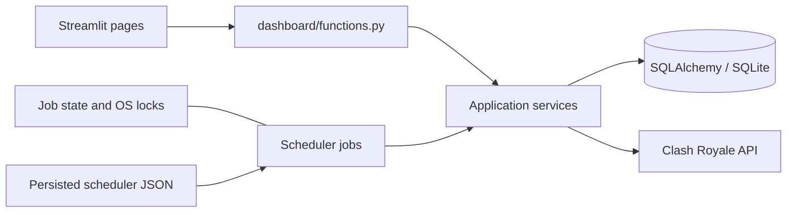

# Architecture and data semantics

Updated: 2026-09-30 · Document version: 0.1.0

## Responsibilities

Streamlit pages own controls and rendering. `dashboard/functions.py` owns page
preparation, detached display values, DataFrames, chart inputs, cache metadata,
and manual-action orchestration. Services perform database queries, API work,
scoring, and synchronization. Models define persisted relationships; Alembic owns
schema changes. `scripts.run_app` supervises the UI and separate scheduler process.

## Correctness boundaries

Roster synchronization validates the response and commits member updates and
departures together. Exceptions roll back the batch. Historical races are committed
as a separate atomic batch; current-race synchronization has its own transaction.
Historical participants absent from the current roster remain stored as departed
members without extra live-player requests. Completed results cannot be overwritten
by a lagging live response.

Current races use an explicit season ID when provided. Otherwise the service uses
chronologically latest completed history, with a numeric next-season inference on
a section reset to zero. This inference assumes sufficiently recent history; it
cannot prove season identity after arbitrary gaps or stale API responses. Nonzero
section regressions are rejected. Live timestamps record observation time until
completed history supplies the API's official creation timestamp. Live boundary
behavior still needs verification before a stable release.

Automatic snapshots include current members only, once per member per local day.
Snapshots contain trophies and donations, not historical last-seen activity.
Previously collected departed-member snapshots are preserved. Retention estimates
therefore inherit limitations of earlier data collection. Trophy growth compares
first and last snapshots within the window for the current roster.

Current rankings exclude `left` and `fired`; historical war views retain former
participants. A participation row alone does not establish an attack: current war
participation requires positive deck usage. Unknown last-seen timestamps remain
unknown and no longer crash inactivity rankings. Membership days count observed
daily increments; downtime is not fabricated as continuous membership.

Contribution scores combine war activity/performance, donations, trophies,
activity, consistency, and seniority. Rank bands and repeated low-fame rules produce
recommendations. Constants live in `app/core/constants.py`. Scores and trends are
descriptive, not predictive, and incomplete history affects their interpretation.

## Migrations

Initialization runs Alembic to head. A repair revision supports databases already
stamped past the historical missing-column migration. Recognized schemas created
with `create_all()` may be adopted after table, column, type, key, and uniqueness
checks; unknown or partially migrated layouts require review. Run upgrades against
a backup copy first. Offline SQL generation is not supported by the inspection-based
repair path. SQLite DDL failure recovery must rely on backups, not an assumption
that every schema change rolls back atomically.

## Performance baseline

Synthetic in-memory SQLite, 50 current members and eight completed races,
2026-09-30 (timings are machine-specific):

| Operation | SQL statements | Elapsed |
| --- | ---: | ---: |
| Overview statistics | 6 | 0.008 s |
| Clan health | 10 | 0.011 s |
| Recommendations | 203 | 0.060 s |
| All contribution scores | 800 | 0.337 s |

Recommendation and score loops are the main query-count targets for future
batching. This is a diagnostic baseline, not a production load test. Reproduce
with `scripts/profile_queries.py` in an isolated directory, setting
`PYTHON_DOTENV_DISABLED=1`, `DATABASE_URL=sqlite:///:memory:`, a temporary `LOG_FILE`,
and `PYTHONPATH` to the source root. It seeds synthetic records only.
