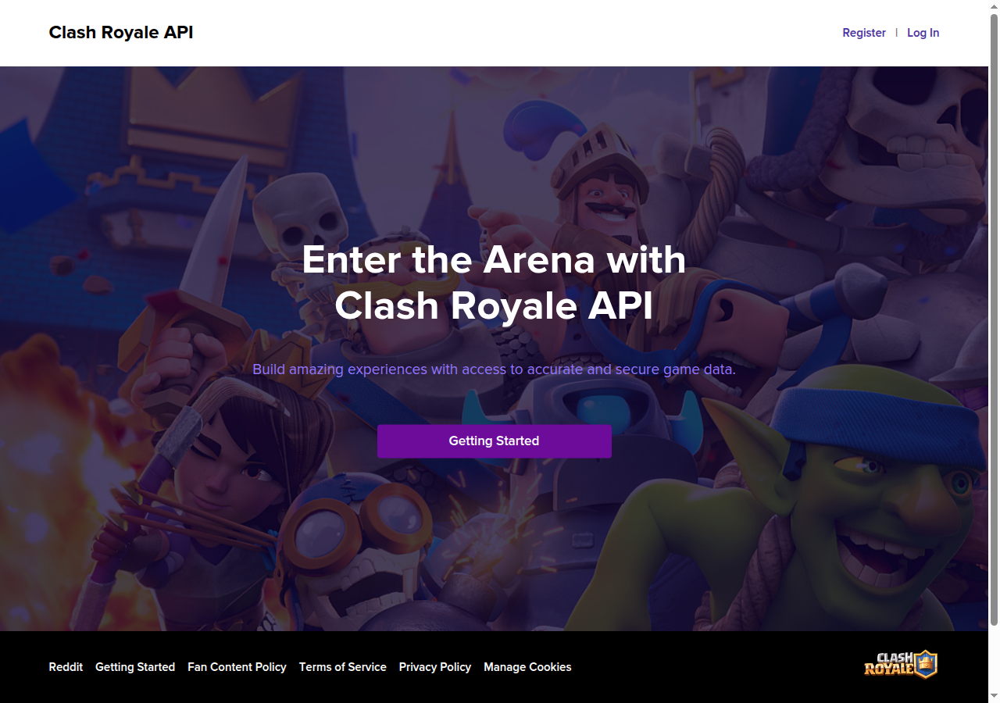
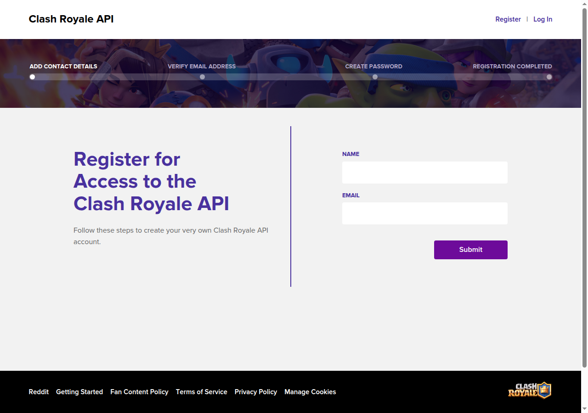
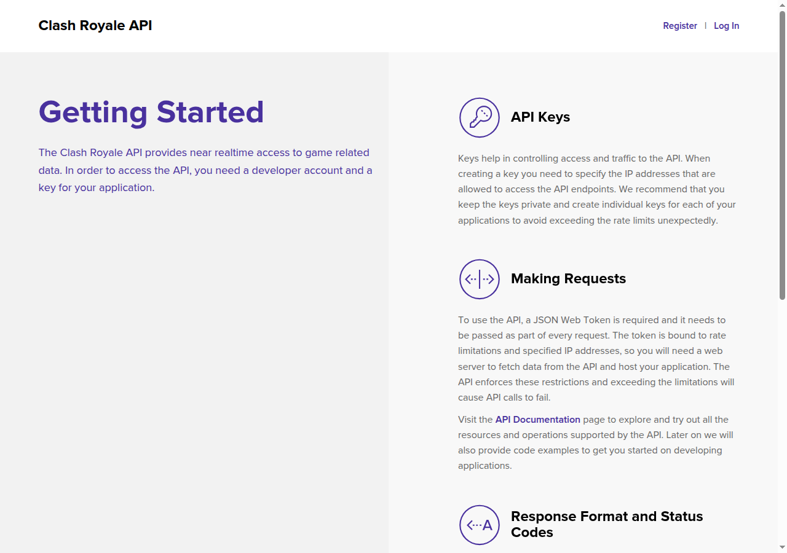

# User guide / Guide utilisateur

Updated / Mise à jour : **2026-10-07** · Version : **1.2.1** (guide only / guide uniquement)

[English](#english) · [Français](#francais) · [Technical reference](../README.md)

## English

### Start here: the standalone application

Clash Royale Clan Manager helps you follow members, donations, activity, wars
and promotion suggestions. It opens in your browser and runs on your computer.
It does not play battles or change clan roles for you.

**Use the standalone download on Windows or Linux. You do not need Docker,
WSL, virtualization, or a Python installation.** The required software is included.
You still need an Internet connection and a Clash Royale API key.

### 1. Download and open

Ask the maintainer for the standalone package for your computer, or open the
[release downloads](https://github.com/RaphaelDP/clash-royale-manager/releases).

| Computer | Choose the filename ending in |
| --- | --- |
| Windows, Intel/AMD 64-bit | standalone-windows.zip |
| Linux, Intel/AMD 64-bit | standalone-linux-x86_64.zip |

For candidate **v1.1.0-rc.1**, download **complete-downloads** from its successful
[GitHub Actions run](https://github.com/RaphaelDP/clash-royale-manager/actions/workflows/launchers.yml),
then select the standalone ZIP inside. GitHub sign-in is required for candidate
artifacts; ask the maintainer for the ZIP if needed. Older v1.0.0 downloads
do not contain standalone packages. Do not choose a package marked **docker** for these instructions.
macOS does not yet have a standalone build; ask the maintainer about its optional
Docker deployment.

1. Download one ZIP and **extract all files** into a permanent location.
2. Open the extracted **ClanManager** folder.
3. On Windows, double-click **ClanManager.exe**. On Linux, double-click **ClanManager**.
4. Keep **python**, **application**, **_internal** and the executable together.
   Do not run the application inside the ZIP viewer or move just the executable.
5. The English and French PDFs are beside the executable.

On Linux, use the file's **Properties → Permissions** to allow execution if needed.
This package is a regular application folder, not an AppImage; it needs no FUSE.
The Windows application is unsigned: if blocked, verify its origin with the
maintainer before allowing that particular application. Do not disable protection
for all downloads.

### 2. Set up your clan

On the first start, the launcher opens **Application settings** if required fields
are missing. You can reopen these settings at any time.

| Field | What to enter |
| --- | --- |
| CR_API_TOKEN | Your private API token from the official Clash Royale developer portal. |
| CLAN_TAG | Your clan's tag, including **#**. Use the clan tag, not your player tag. |

Keep other values at their defaults. **DISCORD_WEBHOOK_URL** is optional and can
remain empty. **SCHEDULER_TIMEZONE** defaults to Europe/Paris; change it only if
automatic tasks should use another timezone.

Confirm the settings dialog and click **Start and open**. First startup prepares
the database and collects data, so allow a little time. There is no Docker image
to download or build. The browser opens at [localhost:8501](http://localhost:8501).
If you used the older application, stop it first to free that address.

The standalone app uses its own data folder and does not automatically import
an old Docker installation. A fresh installation initially has no collected history.
Ask the maintainer to help migrate your previous database before collecting into
a second installation.

#### Create your API account and key, step by step

1. On the computer that will run Clan Manager, open
   [developer.clashroyale.com](https://developer.clashroyale.com/).
   This is a separate developer account; do not paste your game password into the launcher.
2. Click **Register** at the top right.

3. Enter your name and email, then click **Submit**.
   The portal shows four stages: contact details, email verification, password,
   and registration completed.

4. Open the verification email and follow its link/instructions. Check spam if
   necessary. Complete the password step on the official site, then **Log In**.
5. Open your account's API-key management page (usually **My Account**), then
   choose **Create New Key**. Signed-in labels may change.
6. Give it a recognizable name, such as **Clan Manager**, and a description,
   such as **My local clan dashboard**.
7. Enter the **public IPv4 address** of the Internet connection used by the
   computer running Clan Manager in the allowed-IP field. Your router's Internet
   status page or your administrator can provide it. A web search for “what is my
   public IPv4” can also help. Do not use **localhost**, **127.0.0.1**, a private
   **192.168.x.x** address, the clan tag, or the Docker container's address.
8. Create the key, open its details and copy the token. In the launcher →
   **Application settings**, paste it into **CR_API_TOKEN**. Do not add the word
   “Bearer”, extra quotes, or spaces.
9. In Clash Royale, open your clan's information and copy its tag (starts with
   **#**) into **CLAN_TAG**. This is the clan tag, not your player tag.
10. Confirm the settings, click **Start and open**, then **Overview → Refresh Clan Members**.
    Your clan's members should appear. For **403**, recheck the allowed IP and key.
    If your public address changes, update/recreate the key and save the new token.

The key-creation screen requires signing in. We have not used a personal account
or invented screenshots for it; the screenshots above show the actual public
portal. The official guidance confirms that keys are restricted to allowed IPs.

Keep the token private. If exposed, revoke it in the portal and create a replacement.
[Official API guidance](https://developer.clashroyale.com/#/getting-started)

### 3. Everyday use

Open **ClanManager**, then click **Start and open**. Keep the folder containing
the program; a shortcut to its executable is fine.

| I want to… | Open… |
| --- | --- |
| See the clan's overall situation | **Overview** |
| Find a member or filter roles | **Members** |
| See one player's profile and progress | **Player** |
| Review scores and promotion suggestions | **Promotions** |
| Follow the current week and past wars | **Wars** |
| Check automatic tasks or change their schedule | **Settings** |

On **Overview**, **Refresh Clan Members** and **Refresh War Data** fetch current
information. **Recalculate Contribution Scores** updates scores from collected
data. Wait for the result before repeating an action. Refreshing the browser alone
does not force new API data.

“Training days” is normal: those three days do not count as missed war attacks.
Past results remain visible. Personal history grows as data is collected.

In **Settings → Scheduler**, **Save schedule** applies changes within roughly
five seconds. The computer must stay awake and the application must remain running
for automatic collections and reports. Closing only the launcher window leaves
those tasks running.

### 4. Close and reopen

| Action | Result |
| --- | --- |
| Close the browser tab or launcher window | Background tasks keep running. |
| Sidebar **Close → Dashboard only**, then **Confirm close** | Dashboard stops; scheduler continues. Reopen with **Start and open**. |
| Sidebar **Close → Everything**, then **Confirm close** | Dashboard and scheduler stop. |
| Launcher **Stop all**, then confirm | Everything stops and the port is released. Saved data stays. |
| **Cancel** in a confirmation dialog | Nothing stops. |
| Turn off or suspend the computer | Collection cannot run until the computer and application are running again. |

After a computer restart, open the application again. Automatic system-start
installation is not included.

### 5. Your data, backups and updates

The launcher displays **Your data**, the folder storing settings, database, logs,
and backups. It is separate from the downloaded program:

| System | Data folder |
| --- | --- |
| Windows | %LOCALAPPDATA%/ClashRoyaleClanManager |
| Linux | ~/.local/share/ClashRoyaleClanManager (or your XDG_DATA_HOME location) |

On Windows paste the folder path into File Explorer's address bar; on Linux use
your file manager's location field. Keep the default database path in Application
settings unless an administrator has arranged a custom location.

To update:

1. Click **Stop all** and close the launcher.
2. Copy the entire **Your data** folder to a safe location, including hidden files.
3. Download and extract the new standalone package.
4. Open the new **ClanManager** executable. It uses the same data folder and
   applies any needed database upgrade automatically.
5. Once verified, the old program folder can be removed. Keep your data and backups.

There is no automatic downloader and no need for an **Update application** button
in standalone mode. Never replace or delete the data folder when updating.
Your backup contains private credentials; do not send it to other people.
Automatic database backups are under **backups** inside **Your data**; they do not
back up all settings. Restore and migration are maintainer tasks:
[technical instructions](../README.md#backup-and-restore).

### Help

| Problem | What to do |
| --- | --- |
| Missing bundled Python or files | Extract the whole standalone ZIP again. Keep all subfolders together. |
| Port 8501 already in use | Stop the older application or ask for help identifying the program using it. |
| Startup failed | Open **Your data → logs → desktop-startup.log** and share a redacted error message with the maintainer. |
| Browser cannot connect | Click **Start and open** and wait for startup. |
| API access denied / 403 | Check the token and its allowed public IP. |
| Data looks old | Check **Settings → Job Health**, then use the appropriate refresh button. |
| Empty charts | Allow collection time; daily history cannot be reconstructed for past downtime. |
| Disk full | Free space without deleting your data folder. |

Never share an API key, webhook, or **.env**. The standalone dashboard listens on
this computer only and has no login screen. For a server or Docker installation,
use the [optional technical deployment guide](../README.md#docker-deployment).

## Français

### Commencez ici : l'application autonome

Clash Royale Clan Manager permet de suivre les membres, dons, activité, guerres
et suggestions de promotion. L'application fonctionne sur votre ordinateur et
s'affiche dans votre navigateur. Elle ne joue pas de combats et ne modifie pas
les rôles à votre place.

**Sur Windows et Linux, choisissez la version autonome (« standalone »).
Vous n'avez besoin ni de Docker, ni de WSL, ni de virtualisation, ni d'installer
Python.** Les logiciels nécessaires sont inclus. Il faut toujours une connexion
Internet et une clé API Clash Royale.

Les boutons restent en anglais ; ce guide reprend leurs noms exacts.

### 1. Télécharger et ouvrir

Demandez la version autonome au responsable ou ouvrez les
[téléchargements](https://github.com/RaphaelDP/clash-royale-manager/releases).

| Ordinateur | Choisir le fichier dont le nom se termine par |
| --- | --- |
| Windows, Intel/AMD 64 bits | standalone-windows.zip |
| Linux, Intel/AMD 64 bits | standalone-linux-x86_64.zip |

Pour la candidate **v1.1.0-rc.1**, téléchargez **complete-downloads** depuis son
[exécution GitHub Actions réussie](https://github.com/RaphaelDP/clash-royale-manager/actions/workflows/launchers.yml),
puis choisissez le ZIP standalone à l’intérieur. Une connexion GitHub est requise
pour ces fichiers candidats ; demandez le ZIP au responsable si nécessaire.
Les anciens téléchargements v1.0.0 ne contiennent pas de version autonome. Pour ce guide, ne choisissez
pas un fichier marqué **docker**. macOS n'a pas encore de version autonome :
demandez conseil pour son déploiement Docker facultatif.

1. Téléchargez un ZIP et **extrayez tous les fichiers** dans un emplacement permanent.
2. Ouvrez le dossier **ClanManager** obtenu.
3. Sous Windows, double-cliquez sur **ClanManager.exe** ; sous Linux, sur **ClanManager**.
4. Gardez **python**, **application**, **_internal** et l'exécutable ensemble.
   Ne lancez pas l'application depuis la fenêtre du ZIP et ne déplacez pas uniquement l'exécutable.
5. Les guides PDF français et anglais sont à côté de l'exécutable.

Sous Linux, autorisez si nécessaire l'exécution dans **Propriétés → Permissions**.
Il s'agit d'un dossier d'application classique, pas d'une AppImage : FUSE n'est pas
nécessaire. L'application Windows n'est pas signée : en cas de blocage, vérifiez
sa provenance auprès du responsable avant d'autoriser cette application.
Ne désactivez pas la protection générale.

### 2. Configurer votre clan

Au premier lancement, **Application settings** s'ouvre si des champs obligatoires
manquent. Vous pouvez rouvrir cette fenêtre à tout moment.

| Champ | Valeur |
| --- | --- |
| CR_API_TOKEN | Votre jeton API privé obtenu sur le portail officiel Clash Royale. |
| CLAN_TAG | Le tag de votre clan avec le **#**, pas votre tag de joueur. |

Conservez les autres valeurs par défaut. **DISCORD_WEBHOOK_URL** est facultatif et
peut rester vide. **SCHEDULER_TIMEZONE** vaut Europe/Paris ; changez-le seulement
si vous voulez programmer les tâches dans un autre fuseau horaire.

Validez la fenêtre puis cliquez sur **Start and open**. Le premier lancement
prépare la base et collecte les données : patientez. Aucune image Docker n'est
téléchargée ou construite. Le navigateur ouvre
[localhost:8501](http://localhost:8501). Arrêtez l'ancienne application avant de
lancer celle-ci afin de libérer cette adresse.

La version autonome possède son propre dossier de données. Elle n'importe pas
automatiquement une ancienne installation Docker et démarre sans historique
collecté. Demandez de l'aide pour migrer votre ancienne base avant de collecter
dans une deuxième installation.

#### Créer votre compte API et votre clé, pas à pas

1. Sur l'ordinateur qui utilisera Clan Manager, ouvrez
   [developer.clashroyale.com](https://developer.clashroyale.com/).
   Il s'agit d'un compte développeur distinct ; ne collez pas votre mot de passe
   de jeu dans le lanceur.
2. Cliquez sur **Register** en haut à droite.

3. Indiquez votre nom et votre adresse email, puis cliquez sur **Submit**.
   Le portail présente quatre étapes : coordonnées, vérification de l'email,
   mot de passe et inscription terminée.

4. Ouvrez l'email de vérification et suivez ses instructions. Vérifiez les
   courriers indésirables. Créez votre mot de passe sur le site officiel,
   puis cliquez sur **Log In**.
5. Ouvrez la gestion des clés de votre compte (généralement **My Account**),
   puis **Create New Key**. Les intitulés après connexion peuvent évoluer.
6. Donnez un nom reconnaissable, par exemple **Clan Manager**, et une description,
   par exemple **Tableau de bord local de mon clan**.
7. Dans les adresses autorisées, indiquez l'**IPv4 publique** de la connexion
   Internet utilisée par l'ordinateur qui exécutera Clan Manager. Elle est
   disponible dans l'état Internet de votre routeur ou auprès de votre
   administrateur. Une recherche « quelle est mon IPv4 publique » peut aider.
   N'utilisez pas **localhost**, **127.0.0.1**, une adresse privée
   **192.168.x.x**, le tag du clan ou l'adresse du conteneur Docker.
8. Créez la clé, ouvrez ses détails et copiez le jeton. Dans le lanceur →
   **Application settings**, collez-le dans **CR_API_TOKEN**, sans ajouter
   « Bearer », de guillemets ni d'espaces.
9. Dans Clash Royale, ouvrez les informations du clan et copiez son tag, avec
   le **#**, dans **CLAN_TAG**. Ce n'est pas votre tag de joueur.
10. Validez, cliquez sur **Start and open**, puis **Overview → Refresh Clan Members**.
    Les membres doivent apparaître. En cas de **403**, revérifiez la clé et l'IP
    autorisée. Si l'IP publique change, modifiez/recréez la clé et enregistrez le
    nouveau jeton.

La création de clé nécessite une connexion. Nous n'avons utilisé aucun compte
personnel ni inventé de captures pour cet écran ; celles-ci montrent le portail
public réel. La documentation officielle confirme la restriction par adresse IP.

Gardez le jeton privé. S'il est divulgué, révoquez-le et créez-en un nouveau.
[Guide API officiel](https://developer.clashroyale.com/#/getting-started)

### 3. Utilisation quotidienne

Ouvrez **ClanManager**, puis cliquez sur **Start and open**. Gardez le dossier du
programme ; vous pouvez créer un raccourci vers son exécutable.

| Vous voulez… | Ouvrez… |
| --- | --- |
| Voir la situation générale du clan | **Overview** |
| Trouver un membre ou filtrer les rôles | **Members** |
| Consulter un profil et sa progression | **Player** |
| Examiner les scores et suggestions | **Promotions** |
| Suivre la semaine actuelle et les guerres passées | **Wars** |
| Vérifier ou programmer les tâches automatiques | **Settings** |

Dans **Overview**, **Refresh Clan Members** actualise les membres et
**Refresh War Data** actualise les guerres. **Recalculate Contribution Scores**
recalcule les scores. Attendez le résultat avant de recommencer. Actualiser le
navigateur seul ne force pas une récupération depuis l'API.

« Training days » est normal : les trois jours d'entraînement ne comptent pas
comme des attaques manquées. Les anciens résultats restent visibles.
L'historique personnel se remplit au fil des collectes.

Dans **Settings → Scheduler**, **Save schedule** applique les changements sous
environ cinq secondes. L'ordinateur doit rester éveillé et l'application doit
fonctionner pour les collectes et rapports automatiques. Fermer uniquement la
fenêtre du lanceur laisse ces tâches en fonctionnement.

### 4. Fermer et rouvrir

| Action | Résultat |
| --- | --- |
| Fermer l'onglet du navigateur ou la fenêtre du lanceur | Les tâches continuent en arrière-plan. |
| **Close → Dashboard only**, puis **Confirm close** | Le tableau de bord s'arrête, les tâches continuent. Rouvrez avec **Start and open**. |
| **Close → Everything**, puis **Confirm close** | Tableau de bord et tâches s'arrêtent. |
| **Stop all** dans le lanceur, puis confirmer | Tout s'arrête et le port est libéré. Les données sont conservées. |
| **Cancel** dans une confirmation | Rien ne s'arrête. |
| Éteindre ou mettre l'ordinateur en veille | La collecte s'interrompt jusqu'au redémarrage de l'ordinateur et de l'application. |

Après un redémarrage de l'ordinateur, rouvrez l'application. Le démarrage
automatique avec le système n'est pas installé.

### 5. Données, sauvegardes et mises à jour

Le lanceur affiche **Your data**, l'emplacement de la configuration, de la base,
des journaux et des sauvegardes. Ce dossier est séparé du programme téléchargé.

| Système | Dossier de données |
| --- | --- |
| Windows | %LOCALAPPDATA%/ClashRoyaleClanManager |
| Linux | ~/.local/share/ClashRoyaleClanManager (ou l'emplacement XDG_DATA_HOME configuré) |

Collez le chemin dans la barre d'adresse de l'Explorateur Windows ou dans le champ
d'emplacement de votre gestionnaire de fichiers Linux. Gardez le chemin de base
par défaut dans les réglages, sauf configuration particulière par un administrateur.

Pour mettre à jour :

1. Cliquez sur **Stop all** puis fermez le lanceur.
2. Copiez tout le dossier **Your data** en lieu sûr, y compris les fichiers cachés.
3. Téléchargez et décompressez le nouveau paquet autonome.
4. Ouvrez le nouvel exécutable **ClanManager**. Il retrouve le même dossier de
   données et applique automatiquement les migrations nécessaires.
5. Après vérification, vous pouvez supprimer l'ancien dossier du programme.
   Conservez vos données et sauvegardes.

Il n'y a pas de téléchargement automatique ni de bouton **Update application**
en mode autonome. Ne remplacez pas et ne supprimez pas le dossier de données.
Votre sauvegarde contient des identifiants privés : ne la partagez pas.
Les sauvegardes automatiques de base sont dans **backups**, sous **Your data** ;
elles n'incluent pas tous les réglages. La restauration et la migration sont des
opérations pour le responsable : [procédure technique](../README.md#backup-and-restore).

### Besoin d'aide ?

| Problème | Que faire ? |
| --- | --- |
| Python inclus ou fichiers introuvables | Extrayez de nouveau tout le ZIP autonome et gardez les sous-dossiers ensemble. |
| Port 8501 déjà utilisé | Arrêtez l'ancienne application ou faites identifier le programme qui utilise le port. |
| Échec de démarrage | Consultez **Your data → logs → desktop-startup.log** et transmettez une erreur sans données privées au responsable. |
| Le navigateur ne se connecte pas | Cliquez sur **Start and open** puis patientez. |
| Accès API refusé / 403 | Vérifiez le jeton et l'IP publique autorisée. |
| Données anciennes | Consultez **Settings → Job Health**, puis actualisez les données adaptées. |
| Graphiques vides | Laissez les collectes se faire ; l'historique quotidien d'une période d'arrêt n'est pas reconstitué. |
| Disque plein | Libérez de l'espace sans supprimer les données. |

Ne partagez jamais de clé API, webhook ou fichier **.env**. Le tableau de bord
autonome écoute uniquement sur cet ordinateur et n'a pas d'écran de connexion.
Pour un serveur ou Docker, consultez le
[guide technique facultatif](../README.md#docker-deployment).
